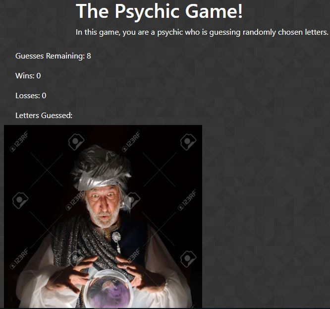

# Psychic-Game
This is my take on a letter guessing game which has been dubbed "The Psychic Game". You are trying to guess a randomly selected letter playing as a psychic with a crystal ball.  

My version includes a few small "easter eggs."  I hope you enjoy!

## Link to Deployed Game
[Psychic-Game](https://rsuttles58.github.io/Psychic-Game/)

## How to Play
To play, simply start tapping on any of the alphabet letters on your keyboard.  If you are incorrect, you will lose a guess.   If you are correct your score will iterate up!  

## Technology Utilized
This is a simple web application that uses, HTML, CSS, javascript.  

## Thoughts
While this application is not much to look at it, it is extremely rewarding for me to look at this project and realize just how far I have come in web development.  What took me days to build and refine could now probably be built in a few hours.  I appreciate the journey and the process along the way and am thankful for this humbling project to look back on.  It was a lot of fun building this application.

